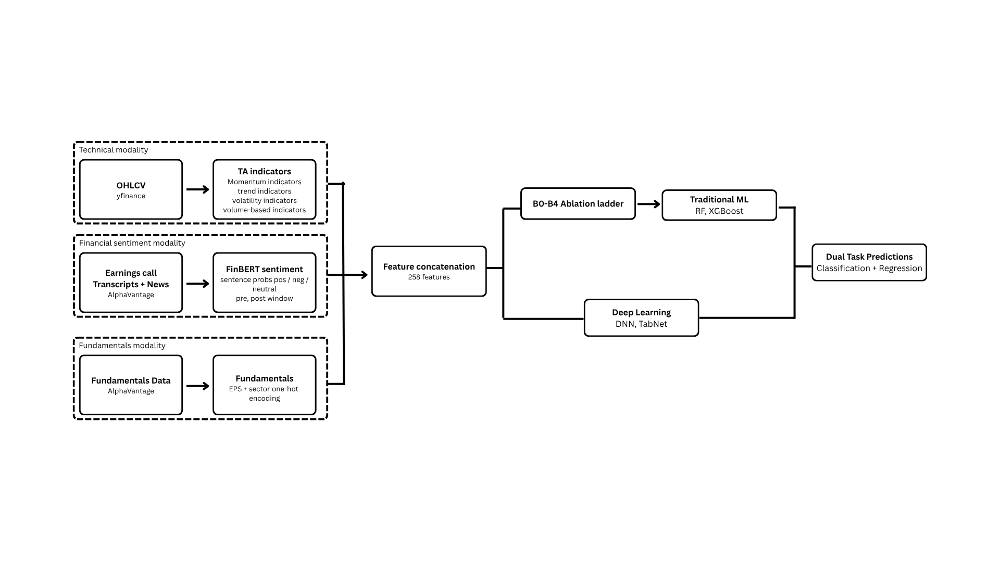

# Post-Earnings Forecast

Predict post-earnings-announcement drift (PEAD) for S&P 500 stocks. The target is the highest intraday price over the nine trading days following each earnings event. Inputs span technical indicators, fundamentals, sector, and NLP sentiment from earnings-call transcripts (FinBERT) and news headlines. Models are trained on a 20-fold expanding-window walk-forward split across 2021 Q1 – 2025 Q4 over ~24,000 earnings events on ~500 S&P 500 constituents.



## Project Structure

```
.
├── pyproject.toml                  # deps, requires-python>=3.12
├── uv.lock
├── src/
│   ├── data/                       # local Parquet data (backups, model staging)
│   ├── ingestion/                  # data fetching, backfill, S3 Delta Lake writes
│   │   ├── table_setup.py          # create Delta tables in S3
│   │   ├── backfill_earnings.py
│   │   ├── backfill_ohvlc.py
│   │   ├── backfill_transcripts.py
│   │   ├── index_data.py           # VIX/SPX from yfinance
│   │   ├── upgrades_downgrades.py
│   │   ├── backup.py               # S3 → local Parquet backup + vacuum
│   │   ├── migration.py            # schema/data migration utilities
│   │   ├── data/                   # local Parquet cache
│   │   └── archive/
│   ├── preprocessing/              # feature engineering, FinBERT, sentiment staging
│   │   ├── technical_features.py   # OHLCV → tech indicators + modeling table
│   │   ├── bert_earnings_call.py   # FinBERT inference on transcripts
│   │   ├── bert_compaction_tx.py   # strip raw text from FinBERT output
│   │   ├── sentiment_stg.py        # aggregate transcript & news sentiment
│   │   └── strat_table.py          # build strategy backtest table
│   ├── modeling/                   # TabNet, DNN, model outputs
│   │   ├── tabnet/                 # Modal GPU TabNet pipeline + trade strategy
│   │   ├── dnn/                    # multitask DNN classifier + regressor
│   │   ├── b1-5/                   # RF/XGBoost ablation experiments (B1–B4)
│   └── notebooks/                  # EDA notebook
```

- **Data**: S3 Delta Lake (primary) + local Parquet backups under `src/ingestion/data/`. S&P 500 tickers, OHLCV, earnings calendars, transcripts, analyst upgrades/downgrades, VIX/SPX.
- **Notebooks**: EDA (`src/notebooks/EDA_final.ipynb`), model training and evaluation (`src/modeling/tabnet/*.ipynb`, `src/modeling/dnn/*.ipynb`).
- **Scripts**: ingestion (`src/ingestion/`), preprocessing (`src/preprocessing/`), modeling (`src/modeling/`).

## Dependencies / Libraries to Install

Python ≥ 3.12. Managed with [`uv`](https://docs.astral.sh/uv/).

| Library | Purpose |
|---|---|
| numpy, pandas, polars, pyarrow | Data wrangling |
| scikit-learn | Baseline models, metrics |
| xgboost | Gradient-boosted trees |
| tensorflow | DNN experiments |
| torch, pytorch-tabnet | TabNet |
| transformers (via HF_TOKEN) | FinBERT embeddings |
| ta-lib | Technical indicators |
| yfinance, requests | Market data fetching |
| deltalake, duckdb, s3fs, boto3 | S3 + Delta Lake I/O |
| modal | GPU jobs (TabNet training) |
| optuna | Hyperparameter tuning |
| matplotlib, seaborn, plotly, altair | Visualisation |
| openpyxl | Excel I/O |

System dependency: `brew install ta-lib` (macOS).

## How to Run

```bash
uv sync                      # install dependencies
cp .env.example .env         # fill in AWS + API keys (see table below)
```

| Variable | Purpose |
|---|---|
| `AWS_ACCESS_KEY_ID` / `AWS_SECRET_ACCESS_KEY` | S3 + Delta Lake |
| `S3_ACCESS_KEY` / `S3_SECRET_KEY` | S3 (secondary pattern) |
| `AWS_SESSION_TOKEN` | S3 session token |
| `S3_BUCKET` | S3 bucket name |
| `AV_PREMIUM_KEY` | Alpha Vantage premium API key |
| `DUCKDB_KEY` | Encrypted Parquet key for DuckDB |
| `HF_TOKEN` | HuggingFace token (Modal GPU jobs) |

AWS region: `ca-central-1`.

### Preprocessing pipeline

The data pipeline flows top-down. Each step depends on the outputs of the previous:

```
┌───────────────────────────────────────────────────────────────┐
│ 1. Ingestion (S3)                                             │
│    backfill_earnings.py → backfill_ohvlc.py                   │
│    → backfill_transcripts.py → index_data.py                  │
│    → upgrades_downgrades.py                                   │
├───────────────────────────────────────────────────────────────┤
│ 2. Engineering & Sentiment                                    │
│    technical_features.py  → tech_modeling_table.parquet       │
│    bert_earnings_call.py  → finbert_tx/ (per-symbol parquet)  │
│    bert_compaction_tx.py  → finbert_tx.parquet (merged)       │
│    sentiment_stg.py       → finbert_tx_agg_weighted.parquet   │
│                           → nz_sentiment.parquet               │
│    strat_table.py         → strat_table.parquet               │
├───────────────────────────────────────────────────────────────┤
│ 3. Model Training                                             │
│    TabNet (Modal GPU) / Multitask DNN / b1-b4 experiments     │
├───────────────────────────────────────────────────────────────┤
│ 4. Strategy Backtest                                          │
│    TABNET_STRAT_4.ipynb    | DNN_STRAT_4.ipynb                │
└───────────────────────────────────────────────────────────────┘
```

**Ingestion**

```bash
python src/ingestion/backfill_earnings.py
python src/ingestion/backfill_ohvlc.py
python src/ingestion/backfill_transcripts.py
python src/ingestion/index_data.py
```

**Preprocessing**

```bash
python src/preprocessing/technical_features.py
python src/preprocessing/bert_earnings_call.py
python src/preprocessing/bert_compaction_tx.py
python src/preprocessing/sentiment_stg.py
python src/preprocessing/strat_table.py
```

**Model training**

```bash
# TabNet on Modal T4 GPU — 20-fold expanding window
python src/modeling/upload_model_data.py
modal run src/modeling/tabnet/modal_tabnet_pead.py
python src/modeling/tabnet/fetch_modal_results.py

# TabNet local (Colab) — Optuna-tuned walk-forward
jupyter src/modeling/tabnet/tabnet_pruned.ipynb

# DNN multitask
jupyter src/modeling/dnn/multitask_dnn_updates.ipynb

# DNN strategy backtest
jupyter src/modeling/dnn/DNN_STRAT_4.ipynb
```

**Model evaluation**

```bash
jupyter src/modeling/tabnet/modal_tabnet_analysis_updated_results.ipynb   # per-fold DA/MAE/RMSE
jupyter src/modeling/tabnet/tabnet_pruned.ipynb                          # loss curves, confusion matrix
jupyter src/modeling/tabnet/TABNET_STRAT_4.ipynb                         # trading-strategy backtest
```

## Results

20 expanding-window walk-forward folds. Directional Accuracy (DA) = 3-class hit rate on out-of-sample quarter. Direction classes: low (<2%) / moderate (2–4%) / strong (≥4%) peak return over t+1…t+9. Baseline (always majority class): DA = 0.332.

### TabNet vs DNN — 20-fold walk-forward (direction)

| Model | Mean DA | Mean MAE | Mean RMSE | Best fold DA | Worst fold DA | Test rows |
|---|---|---|---|---|---|---|
| TabNet (initial) | 0.4371 | 0.0313 | 0.0476 | 0.702 (2022 Q4) | 0.299 (2024 Q2) | 9,937 |
| TabNet (updated) | 0.4495 | 0.0303 | 0.0446 | 0.690 (2022 Q4) | 0.335 (2025 Q1) | 9,937 |
| Multitask DNN | 0.4573 | 0.0296 | 0.0428 | 0.700 (2022 Q4) | 0.359 (2024 Q1) | 7,967 |

Both models consistently beat the 0.332 baseline; the DNN edges TabNet on mean DA and RMSE.

### Trading strategy backtest (TabNet predictions, exit at 2% gain or t+10)

Strat 1 enters long when TabNet predicts class 1 or 2, exits at +2% or after 10 trading days. No transaction costs or slippage.

| Metric | Value |
|---|---|
| Initial capital | $50,000 |
| Position size | $200 |
| Trades | 8,221 |
| Skipped (insufficient cash) | 0 |
| Net P&L | $6,637 |
| Win rate | 75.9% |
| Final equity | $56,637 |
| Annualised Sharpe (portfolio) | 2.04 |
| Max drawdown | −4.45% |


### Caveats

- Results assume zero transaction costs and slippage — see `docs/strat file implementation.md` for outstanding validation items (walk-forward threshold selection, cost grids, deployed-capital Sharpe, drawdown / Calmar / Sortino, benchmark comparison).
- The `model_outputs/` directory contains per-fold results (Parquet, JSON histories, pickled models) for both TabNet and DNN runs; these are the canonical data used by the strategy notebooks.


### Raw data link 
Google Drive - [backup folder](https://drive.google.com/drive/folders/1RaFeSjkrssJbS9sckS0iFaSpIXfA_z4V?usp=sharing)

The backup folder sits withint src/data
